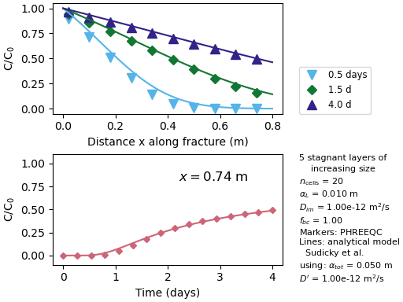

# Geochemical modeling: Python scripts for PHREEQC simulations of groundwater solute transport in a rock fracture. Comparison with PHAST

This GitHub repository contains [Python](https://www.python.org/)
scripts to facilitate 
[reactive transport simulations](https://en.wikipedia.org/wiki/Reactive_transport_modeling_in_porous_media)
in rock fractures with rock matrix diffusion,
using the geochemical modeling software
**[PHREEQC](https://www.usgs.gov/software/phreeqc-version-3)** 
([Parkhurst and Appelo 2013][10]).  A comparison is also provided
of similar models using
**[PHAST](https://www.usgs.gov/software/phast-a-computer-program-simulating-groundwater-flow-solute-transport-and-multicomponent)**
([Parkhurst et al. 2010][15]).

### Take home messages

- Phyton is a great tool to write PHREEQC input files to
  model groundwater solute transport in a fracture with matrix diffusion.
  Other programming languages could be used for the task.
- Python + Pandas DataFrames are extremely useful to plot the multidimensional
  results obtained from this kind of models.  Similar packages
  in other programming languages could be used for this purpose.
- For long fractures, larger than perhaps 10 m, the computation time
  for PHREEQC is too long, becoming impractical.  Parallelized
  software, such as PHAST is needed to model such systems.

### Background
Groundwater flow in fractured rocks may be visualized as the
fluid flowing only in the fractures.  The groundwater contained in
the rock-matrix pores is considered to be immobile.  Solutes
dissolved in the groundwater are transported in the
fractures by [advection](https://en.wikipedia.org/wiki/Advection),
and they also [diffuse](https://en.wikipedia.org/wiki/Diffusion)
through the fracture walls into (or out from) the rock matrix pore volume.
For the purpose of solute transport, the rock may be seen as having
two types of porosity: the fractures and the rock matrix pores,
that is, the rock may be idealized as a dual porosity aquifer.

**PHREEQC** offers the possibility to model one-dimensional (1D) reactive
transport of solutes. The 1D system is divided into a number of
_calculation cells_ of equal length and pore volume.  To model a
dual porosity system, additional immobile (rock matrix) cells
are connected to the mobile (fracture) cells. These immobile
cells represent the stagnant zone that is accessible only by diffusion.
Each flowing cell is connected to a series of one or more stagnant cells.
These series of stagnant cells are isolated from each other, so that
diffusion is not considered between immobile cells adjacent in the
flow direction; that is, diffusion takes place only perpendicular
to the flowing fracture.

Detailed information on how PHREEQC can be used to model 1D reactive
transport in dual porosity media is given in the following sections of the
[_user's guide_](https://water.usgs.gov/water-resources/software/PHREEQC/documentation/phreeqc3-html/phreeqc3.htm):

 * [The Advection-Reaction-Dispersion Equation](https://wwwbrr.cr.usgs.gov/projects/GWC_coupled/phreeqc/html/final-22.html#pgfId-252121)
 * [Transport in Dual Porosity Media](https://wwwbrr.cr.usgs.gov/projects/GWC_coupled/phreeqc/html/final-24.html#pgfId-329241)
 * [Example 13 - 1D Transport in a Dual Porosity Column with Cation Exchange](https://wwwbrr.cr.usgs.gov/projects/GWC_coupled/phreeqc/html/final-82.html#pgfId-343205)

Other references of interest are: [Appelo et al. (1998)][1], and 
[Charlton and Parkhurst (2011)][2].

**PHAST** simulates three-dimensional groundwater flow and transport
of solutes using a modified version of a previous code (HST3D).
Geochemical reactions are simulated with the geochemical model PhreeqcRM
([Parkhurst and Wissmeier, 2015][14]).  A graphical user interface,
_Phast4Windows_, is available ([Charlton and Parkhurst, 2013][3]).
The parallel version of PHAST considerably reduces calculation times.

#### Motivation for this repository

In PHREEQC, dual-porosity models require a `TRANSPORT` and
several `MIX` input keywords, as described in the [user's guide][3].
The calculation of the mixing fractions for each grid cell is
tedious and prone to mistakes, especially if a parameter sensitivity
analysis is to be performed.  A Python script facilitates the task,
as suggested
[here](https://github.com/NumericalEnvironmental/Facilitator_scripts_for_reactive_flow_through_fractured_rock_with_PHREEQC).

[Example 13](https://wwwbrr.cr.usgs.gov/projects/GWC_coupled/phreeqc/html/final-82.html#pgfId-343205)
in the PHREEQC distribution contains input files to model
reactive transport in a dual porosity medium, such as soil, sandstone
or mine tailings (not for a fracture).  [Lipson et al (2007)][6]
provide a description of how to calculate the mixing fractions needed
to simulate dual porosity transport along a rock fracture, but actual
input files to model reactive transport in a rock fracture including
matrix diffusion are difficult to find.

The purpose of this repository is:

 - To provide examples of PHREEQC input files to model solute
   transport in rock fractures.
 - To show:
   + How Python scripts may be used to automatically generate the `MIX`
     input keywords required by PHREEQC.
   + How Python scripts may be used to plot the results from the
     simulations.  [Pandas DataFrames](https://pandas.pydata.org/docs/getting_started/intro_tutorials/index.html)
     make it easy to select the data to be plotted, for example
     as a function of time at a given distance in the flow direction,
     or _versus_ the distance into the matrix for a given simulated time.

In addition, the examples in the repository show that
PHAST is a more efficient simulator for these types of systems.

## The examples used

The fracture systems described in the following publications are
used as examples:

 - [Tang et al. (1981)][17]
 - [Lipson et al. (2007)][6]
 - [Muskus and Falta (2018)][7] 

Both Phyton scripts and the PHREEQC and PHAST input- and output-files can
be found in corresponding folders.

## The Python scripts

Some characteristics of the Python scripts used to run PHREEQC and plot
the results:

 - The number of calculation cells, `n_cells`, may be changed.
   This value affects the accuracy of the numerical results as
   well as the time spent for the calculations.
 - The rock matrix is simulated using a series of stagnant cells
   for each flowing cell.  It is possible to selected between
   a few discretizations of the rock matrix: equal length or
   increasing lengths.
 - The Python script creates the input files and runs PHREEQC.
   The results are saved in a `*.tsv`-file using the PHREEQC
   input keyword `SELECTED_OUTPUT`.
 - If the `tsv`-file is newer than the input files for PHREEQC,
   then the calculations are not performed, instead the results
   in the `tsv`-file are used for plotting.
 - Finally the Python scripts use the results to make one or
   more figures, and they are saved in sub-folder `plots`.
 - All scripts have been tested under Windows.

### The boundary-condition factor

The finite difference method used to model rock matrix diffusion
includes a boundary-condition factor, _fbc_
(section “Transport in Dual Porosity Media” in [Parkhurst and Appelo 1999][9]).
It is stated that for stagnant cells of equal volume, _fbc_ = 1.
If adjacent cell volumes are not unequal, _fbc_
may be calculated based on their respective volumes, see
eqn.(127) in [Parkhurst and Appelo (1999)][9] and eqn.(29)
in [Parkhurst and Appelo (2013)][10].

The Python scripts may be used to test different values for
_fbc_.  Tests show that a value of _fbc_ = 1
is adequate for all the simulations of dual porosity
groundwater transport along a fracture.

### Analytical expressions

In the examples, a tracer is introduced up-stream into the fracture.
The PHREEQC (or PHAST) results consist of values for the relative
concentration, C/C0, and they are plotted in the figures
together with theoretical curves for comparison:

 - The analytical model by [Sudicky and Frind (1982)][16]: a Fortran
version of this model was programmed by Sudicky, and
kindly transmitted to [Toran (2000)][18] who made it publicly
available.  The Python version of the code is used here.
- The equation proposed by [Neretnieks (1980)][8]. This equation
does not include the effect of dispersion, and it can not be used without
rock matrix diffusion. Furthermore, it assumes an infinite rock matrix.

## [Lipson et al. (2007)][6]

[Lipson et al. (2007)][6] describe how to use PHREEQC to model solute
transport in a single fracture in porous rock.  They provide details
about how to calculate the mixing factors, and writing
the corresponding PHREEQC input file is quite straightforward.

In this case the modeled rock fracture has an aperture of 0.4 mm and it
is 3 m long. The groundwater velocity is 1.5 m/day, and the system
is modeled for 100 days.  The rock matrix has a porosity of 0.2
and a maximum diffusion depth of 0.25 m.

The file `2007Lipson_et_al.py` may be used to generate
PHREEQC input files using the parameters given in Lipson et al. (2007).

 - Although Lipson et al. (2007) discretized the flow path
   into 200 cells, in the Python script the user may select
   longer cell lengths, which requires shorter execution times.
 - In addition to the model with 5 equally sized stagnant cells used
   by Lipson et al. (2007), a model with four cells of increasing
   size can be chosen.

On a 2.4 GHz CPU computer, the calculation times for the 20 cells models
are between 35 and 45 secs.  For models with 200 cells, the calculation times
are 30 to 36 mins, depending on the number of layers (4 or 5) used to model
the rock matrix.  The parallelized PHAST run for the 200 cells model takes around
27 seconds.

The following figure shows PHREEQC results, in terms of
the relative concentration of an inert tracer introduced up-stream
into the fracture.

  
**Figure 1.** The concentration, _C_, of an inert tracer
introduced up-stream into the fracture, relative to its
in-flowing concentration _C0_, at different times
and distance, compared with the model the analytical equation by
[Neretnieks (1980)][8].  Model with 20 advective cells and 4 stagnant
cells of increasing size.

## [Tang et al. (1981)][17]

[Tang et al. (1981)][17], developed an analytical expression to describe
the transport of solutes in a single fracture in porous rock.
Later [Sudicky and Frind (1982)][16] published a corresponding analytical
expression for a system of parallel fractures.  Tang et al. (1981) compared
the results obtained using their analytical model
with the numerical simulation by [Grisak and Pickens (1980)][4] of
the laboratory data from [Grisak et al. (1980)][5],  see Figs. 9 and 10
in [Tang et al. (1981)][17].  This model example
has also been used in other publications, such as
[Watanabe and Kolditz (2015)][19] and [Weatherill et al. (2008)][20].

The system consists of a rock block 0.1 m thick and 0.8 m long with
a fracture along its length with an aperture of 0.12 mm.
The groundwater velocity is 0.75 m/day.  The simulated time is 4 days.
The rock matrix has a porosity of 0.35 and the maximum diffusion
depth is 0.05 m.  [Tang et al. (1981)][17] made calculations for
a range of diffusion coefficients, the example used here
uses _De_ = 3.5x10-13
m2/s.

The Python script may be used to generate PHREEQC input files,
to run them, and plot the results.

On a laptop with a 2.4 GHz CPU, the calculation times for the 20 cells models are
around 8 to 10 seconds.  For models with 100 cells, the calculation times are
3 to 6 mins, depending on the number of layers (5 or 10) used to model
the rock matrix.  The parallelized PHAST calculation with 100 cells and 5 rock matrix
layers takes 21 secs.

**Figure 2.** The markers show the fracture water concentration, _C_,
of an inert tracer introduced up-stream, relative to its in-flowing
concentration _C0_, at different times as a function of
the distance (top) and as a function of time 0.74 m into the fracture
(bottom).  The lines are calculated using the analytical model CRAFLUSH
([Sudicky and Frind, 1982][16] and [Toran, 2000][18]).

## [Muskus and Falta (2018)][7]

[Muskus and Falta (2018)][7] present the results for a more **complex** system:
 - The **fracture is longer** than in previous examples; 50 m.
 - **Longer simulated times:** the in-flowing tracer source is maintained
   for a period of 50 years, before it is removed, and the system is
   then flushed for 150 years.  The total simulated time is 200 yr.
 - **Reactive transport:** the retardation factor of the tracer in the matrix is
   _R'_ = 2.  This is accomplished by including ion-exchange reactions,
   similar to [Example 13](https://wwwbrr.cr.usgs.gov/projects/GWC_coupled/phreeqc/html/final-82.html#pgfId-343205)
   in the PHREEQC distribution.  The in-flowing solution during the initial
   50 yr contains NaNO3, and initially the fracture contains KCl
   and the rock matrix KClO4.  During the following flushing period
   of 150 yr, the in-flowing solution contains KCl.
   In this way it is possible to plot the concentrations of both the
   retarded (Na+) and inert (NO3-) solutes
   in the in-flowing water.

Other characteristics of the system are: the fracture aperture is 0.1 mm;
the groundwater velocity is 100 m/yr; the matrix porosity is 0.1 and
the maximum diffusion depth is 0.25 m.  Because the calculation times
are so long, only a model with equally sized 4 stagnant layers is used for the
rock matrix.

On a computer with a 2.4 GHz CPU, the calculation times for the 125 cells model
is 4 hours.  For models with 400 cells, the calculation time is 34.5 hours.
The parallelized PHAST calculation with 400 cells takes 0.8 hours.

**Figure 3.** The markers show the fracture water concentration, _C_,
relative to the in-flowing concentration, _C0_,
as a function of the distance and for different simulated times.
Results are plotted for two tracers, one retarded in the rock matrix (Na)
and one inert (NO3), both introduced up-stream for a period of 50 years.
The lines are calculated using the analytical model CRAFLUSH
([Sudicky and Frind, 1982][16] and [Toran, 2000][18]).

**Figure 4.** The markers show the rock matrix porewater concentration, _C_,
relative to the in-flowing concentration, _C0_,
as a function of the distance into the rock matrix, and for
different simulated times and distances along the fracture.
Results are plotted for two tracers, one retarded (Na) and one inert
(NO3), both introduced up-stream into the fracture
for a period of 50 years.
The lines are calculated using the analytical model CRAFLUSH
([Sudicky and Frind, 1982][16] and [Toran, 2000][18]).

## References

Appelo C.A.J., Verweij E., Schäfer H. (1998) A hydrogeochemical transport
model for an oxidation experiment with pyrite / calcite / exchangers /
organic matter containing sand.
_Applied Geochemistry_ **13**, 257-268.
https://doi.org/10.1016/S0883-2927(97)00070-X

[1]: https://doi.org/10.1016/S0883-2927(97)00070-X

Charlton S.R., Parkhurst D.L. (2011) Modules based on the geochemical
model PHREEQC for use in scripting and programming languages.
_Computers & Geosciences_ **37**, 1653-1663.
https://doi.org/10.1016/j.cageo.2011.02.005

[2]: https://doi.org/10.1016/j.cageo.2011.02.005

Charlton S.R., Parkhurst, D.L. (2013)
Phast4Windows: A 3D graphical user interface for the reactive-transport
simulator PHAST.
_Groundwater_ **51**, 623-628.
https://doi.org/10.1111/j.1745-6584.2012.00993.x

[3]: https://doi.org/10.1111/j.1745-6584.2012.00993.x

Grisak G.E., Pickens J.F. (1980) Solute transport through fractured media: 1.
The effect of matrix diffusion.
_Water Resources Research_ **16**, 719-730.
https://doi.org/10.1029/WR016i004p00719

[4]: https://doi.org/10.1029/WR016i004p00719

Grisak G.E., Pickens J.F., Cherry J.A. (1980) Solute transport through
fractured media: 2. Column study of fractured till.
_Water Resources Research_ **16**, 731-739.
https://doi.org/10.1029/WR016i004p00731

[5]: https://doi.org/10.1029/WR016i004p00731

Lipson, D.S., McCray, J.E., Thyne, G.D. (2007) Using PHREEQC to simulate
solute transport in fractured bedrock.
_Ground water_ **45**, 468-472.
https://doi.org/10.1111/j.1745-6584.2007.00318.x

[6]: https://doi.org/10.1111/j.1745-6584.2007.00318.x

Muskus, N., Falta, R.W. (2018) Semi-analytical method for matrix diffusion in
heterogeneous and fractured systems with parent-daughter reactions.
_Journal of Contaminant Hydrology_ **218**, 94-109.
https://doi.org/10.1016/j.jconhyd.2018.10.002

[7]: https://doi.org/10.1016/j.jconhyd.2018.10.002

Neretnieks, I. (1980) Diffusion in the rock matrix:
An important factor in radionuclide retardation?
_Journal of Geophysical Research: Solid Earth_ **85**, 4379-4397.
https://doi.org/10.1029/JB085iB08p04379

[8]: https://doi.org/10.1029/JB085iB08p04379

Parkhurst D.L., Appelo C.A.J. (1999) User’s guide to PHREEQC (version 2) -
A computer program for speciation, batch-reaction, one-dimensional transport,
and inverse geochemical calculations.
*Water-Resources Investigations Report* 99-4259, vers.2.
U.S. Geological Survey, Denver, Colorado.
https://doi.org/10.3133/wri994259

[9]: https://doi.org/10.3133/wri994259

Parkhurst D.L., Appelo C.A.J. (2013) Description of input and
examples for PHREEQC version 3 - A computer program for speciation,
batch-reaction, one-dimensional transport, and inverse geochemical
calculations. In *U.S. Geological Survey Techniques and Methods*, Book 6,
Chap. A43.  US Geological Survey; available only at
https://pubs.usgs.gov/tm/06/a43/, Denver, Colorado.

[10]: https://doi.org/10.3133/tm6A43

Parkhurst D.L., Wissmeier L. (2015) PhreeqcRM: A reaction module
for transport simulators based on the geochemical model PHREEQC.
_Advances in Water Resources_ **83**, 176-189.
https://doi.org/10.1016/j.advwatres.2015.06.001

[14]: https://doi.org/10.1016/j.advwatres.2015.06.001

Parkhurst D.L., Kipp K.L., Charlton S.R. (2010) PHAST Version 2 -
A program for simulating groundwater flow, solute transport,
and multicomponent geochemical reactions
*U.S. Geological Survey Techniques and Methods* 6-A35.
US Geological Survey, Reston, VA. 235 p.
https://doi.org/10.3133/tm6A35, 

[15]: https://doi.org/10.3133/tm6A35

Sudicky, E.A., Frind, E.O. (1982) Contaminant transport in fractured porous
media: Analytical solutions for a system of parallel fractures.
_Water Resources Research_ **18**, 1634-1642. 
https://doi.org/10.1029/WR018i006p01634

[16]: https://doi.org/10.1029/WR018i006p01634

Tang, D.H., Frind, E.O., Sudicky, E.A. (1981) Contaminant transport in
fractured porous media: Analytical solution for a single fracture.
_Water Resources Research_ **17**, 555-564.
https://doi.org/10.1029/WR017i003p00555

[17]: https://doi.org/10.1029/WR017i003p00555

Toran, L. (2000) CRAFIT: A computer program for calibrating
breakthrough curves of CRAFLUSH, a one-dimensional fracture flow and
transport model.
_Groundwater_ **38**, 430-434.
https://doi.org/10.1111/j.1745-6584.2000.tb00229.x

[18]: https://doi.org/10.1111/j.1745-6584.2000.tb00229.x

Watanabe, N., Kolditz, O. (2015) Numerical stability analysis of
two-dimensional solute transport along a discrete fracture in a
porous rock matrix,
_Water Resources Research_ **51**, 5855-5868.
https://doi.org/10.1002/2015WR017164

[19]: https://doi.org/10.1002/2015WR017164

Weatherill, D., Graf, T., Simmons, C.T., Cook, P.G., Therrien, R.,
Reynolds, D.A. (2008) Discretizing the fracture-matrix interface to
simulate solute transport.
_Groundwater_ **46**, 606-615.
https://doi.org/10.1111/j.1745-6584.2007.00430.x

[20]: https://doi.org/10.1111/j.1745-6584.2007.00430.x
